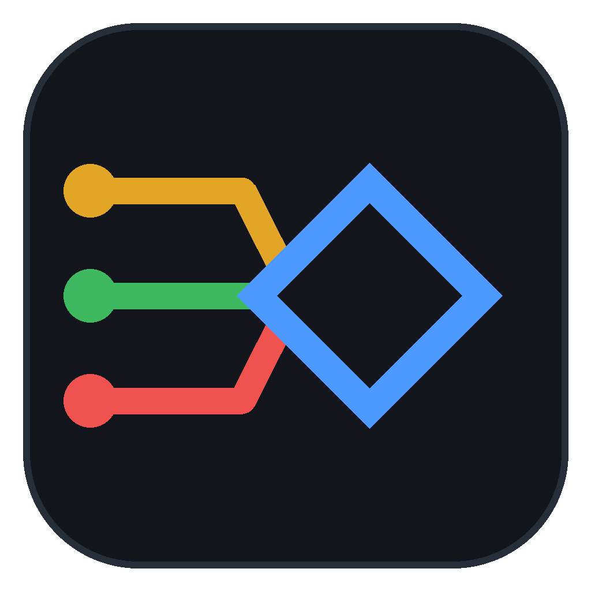
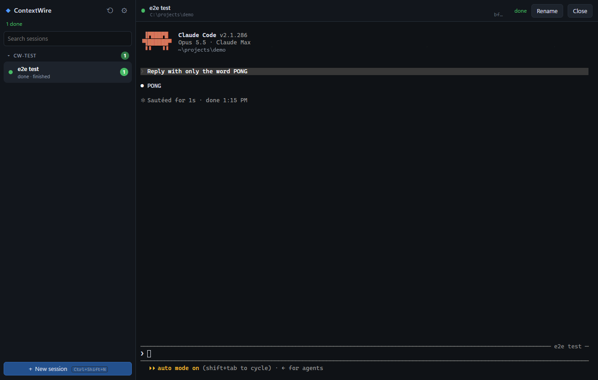
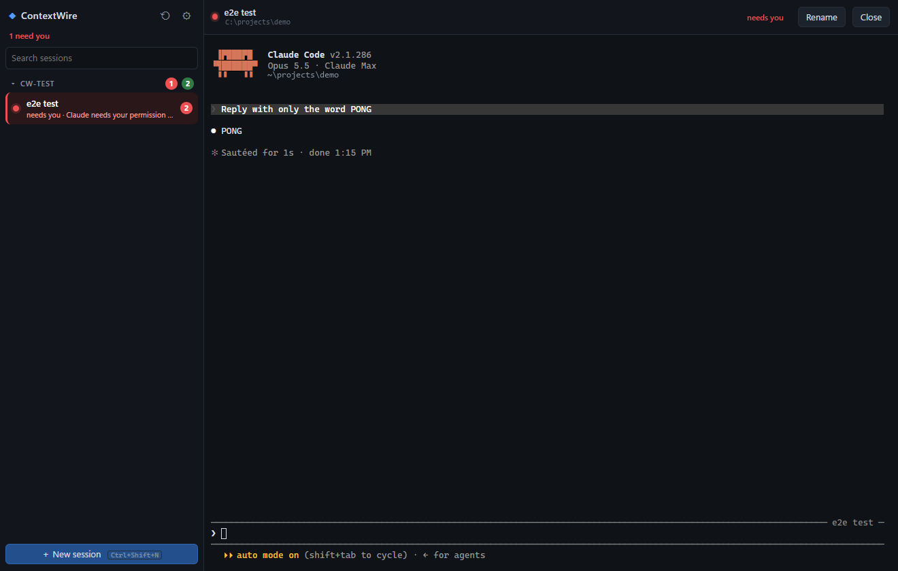

<p align="center">
  
</p>

<h1 align="center">ContextWire</h1>

<p align="center">
  <b>One window for every Claude Code console.</b><br>
  A chat-app style home for all your <a href="https://code.claude.com">Claude Code</a> sessions on Windows -
  across every workspace and repo - with live consoles, status highlights and notifications.
</p>

<p align="center">
  
  
</p>

> **Status:** early (v0.4.x), Windows 10/11 only. Used daily by its author; expect rough edges.
> Not affiliated with Anthropic.

---

**Documentation:** [docs/](docs/README.md) - getting started, using the app, scheduled
agent jobs, Git, architecture, privacy and security, troubleshooting, development.

## Why

If you run Claude Code in several repos at once, you end up with a pile of terminal
windows and keep clicking through them to see which one has finished, which one is
stuck on a permission prompt, and where that session from yesterday lived so you can
`claude --resume` it.

ContextWire puts them all in one window, like a chat app:

- every **chat is a real `claude` console** (not a re-implementation) - slash commands,
  permission prompts, skills, your settings and `CLAUDE.md` all work as usual;
- sessions **light up when they need you** - bold + unread badge when a turn finishes
  in the background, red and floated to the top when Claude is waiting on a permission
  prompt - with a Windows toast and a taskbar flash;
- every workspace lists its **earlier sessions**, so resuming one is a single click.

### How is this different from the official Claude desktop app?

The official app (Code tab) also runs parallel sessions in a sidebar, but it uses its
own graphical chat UI and **cannot attach to a session running in a terminal** -
`/desktop` hands a CLI session over and exits it, and the two keep separate session
lists. ContextWire keeps the real CLI as the console and tracks status through Claude
Code [hooks](https://code.claude.com/docs/en/hooks). Features of the official app that
would be nice here are tracked as an upgrade backlog (see [Roadmap](#roadmap)).

## Features

- **Chat-style sidebar** grouped by workspace root, auto-discovered from
  `~/.claude/projects` (add or remove roots in Settings).
- **Live consoles** - xterm.js on top of Windows ConPTY; each session keeps its
  scrollback while you switch.
- **Status per session**: starting, ready, working, **needs you**, done, ended.
- **Unread badges and highlights**; needs-you rows float to the top; opening a session
  clears it.
- **Notifications**: Windows toast + taskbar flash (configurable).
- **Earlier sessions in every workspace**, newest first, one click to resume in the right
  folder - like `claude --resume`, for all workspaces at once. Sessions active in the last
  few minutes are tagged *active* and open paused ("Adopt here") so a conversation that is
  still open in a terminal is never resumed twice.
- **History** dialog with search across every past session.
- **Restore after restart** - open sessions come back with `claude --resume`.
- **Tray app**: closing the window hides it; autostart with Windows (toggle in Settings);
  single instance.
- **Optional: track sessions started in plain terminals** (installs ContextWire's status
  hook in `~/.claude/settings.json`, with a backup; off by default).
- **Troubleshooting**: a rotating log and a *Copy diagnostics* button
  (no prompts or conversation text are ever logged).

Shortcuts: `Ctrl+Shift+N` new session · `Ctrl+Shift+H` history · `Ctrl+Shift+U` jump to
the next session that needs you. Plain `Ctrl` keys are left to Claude.

## Install

There is no signed release yet - build it from source (about 5 minutes the first time).

**Prerequisites**

- Windows 10/11 (x64) with the [WebView2 runtime](https://developer.microsoft.com/microsoft-edge/webview2/) (preinstalled on Windows 11)
- [Claude Code](https://code.claude.com) CLI on `PATH` (`claude --version`)
- [Node.js](https://nodejs.org) 20+
- [Rust](https://rustup.rs) stable (MSVC toolchain) and the Visual Studio C++ build tools -
  see the [Tauri prerequisites](https://tauri.app/start/prerequisites/)

```powershell
git clone <this repo> ContextWire
cd ContextWire
npm install
npm run tauri build
# then run the installer:
.\src-tauri\target\release\bundle\nsis\ContextWire_*_x64-setup.exe
```

The installer is per-user (no admin rights) and installs to
`%LOCALAPPDATA%\ContextWire`. On first start the release build registers itself to
start with Windows (minimized to the tray) - turn that off in **Settings**.
Because the build is unsigned, Windows SmartScreen may warn the first time.

## Using it

1. **New session** (or `+` on a workspace header) - pick a workspace, optionally a repo
   inside it, a name, and whether to isolate it in a git worktree.
2. Work in the console exactly as in a terminal.
3. Switch away. When Claude finishes, the row turns bold with a badge; when it needs a
   permission or an answer, it turns red, jumps to the top and you get a toast.
4. Click an **earlier session** under any workspace to continue it.

**Settings** (gear icon): notifications, autostart, tracking terminal sessions,
workspace roots, and *Troubleshooting* (Copy diagnostics, Open logs folder).

## How it works

```
 ContextWire.exe (Tauri 2)
 ├─ Rust (src-tauri/src)
 │   ├─ pty.rs          one ConPTY per session running `claude`
 │   ├─ hookserver.rs   127.0.0.1:<random port>, per-install token  ──► "hook-event" to the UI
 │   ├─ hook.rs         `ContextWire.exe --hook`: Claude Code hook client (stdin JSON -> POST)
 │   ├─ claudecfg.rs    per-session --settings hooks; opt-in global hooks (with backup)
 │   ├─ workspaces.rs   past sessions + workspace folders from ~/.claude/projects
 │   ├─ applog.rs       rotating log file
 │   └─ lib.rs          commands, tray, single instance, autostart, notifications
 └─ UI (src, vanilla TypeScript + xterm.js)
     ├─ status.ts       pure status machine (hook event -> status / unread / notify)
     ├─ sidebar.ts      workspaces -> sessions -> earlier sessions
     ├─ terminal.ts     one xterm per session
     └─ main.ts         state, events, dialogs, persistence
```

Each session is started as
`claude --session-id <uuid> --settings <hooks.json>` (or `--resume <uuid>`) in the chosen
folder. The hooks file registers `ContextWire.exe --hook` for `SessionStart`,
`UserPromptSubmit`, `PreToolUse`, `PostToolUse`, `Notification`, `Stop` and `SessionEnd`.
The hook client forwards the event to the app over localhost and always exits `0`
within about half a second, so it can never block or break Claude - even when
ContextWire is not running. Nothing in your global Claude settings changes unless you
turn on *Track sessions started in plain terminals*.

More detail: [docs/architecture.md](docs/architecture.md), [PLAN.md](PLAN.md) (design and
decisions) and [docs/changelog.md](docs/changelog.md).

## Privacy and security

- Everything stays on your machine. ContextWire makes no network calls of its own; the
  `claude` CLI talks to Anthropic exactly as it does in a terminal.
- The hook endpoint listens on `127.0.0.1` only and rejects requests without the
  per-install token stored in `%APPDATA%\ContextWire\endpoint.json`.
- Logs and diagnostics record events, folders, tool names and exit codes - never prompts
  or conversation text.
- See [SECURITY.md](SECURITY.md) to report a vulnerability.

## Limitations

- A Claude session can be attached to one console at a time: ContextWire replaces
  terminal windows, it does not mirror them. Use *Adopt here* to move a session in.
- Quitting the app ends its consoles (they are restored with `--resume` next time).
- Windows only for now; the Rust and UI code is mostly portable, contributions welcome.

## Development

```powershell
npm install
npm run tauri dev        # app with hot reload (debug build; autostart is never registered)
npm test                 # UI status-machine tests (node --test)
npx tsc --noEmit         # type check
cargo test --manifest-path src-tauri/Cargo.toml          # Rust tests (ConPTY, hooks, settings, logs)
python -m unittest discover -s watchtower/tests -q       # watchtower tests (needs PyYAML)
```

Only one instance can run at a time (debug and release share an identifier) - quit the
installed app from its tray menu before `tauri dev`.

### Roadmap

Build status lives in [`roadmap.yaml`](roadmap.yaml), and a small local dashboard shows it:

```powershell
python watchtower/server.py          # http://127.0.0.1:8766  (Build + Features tabs)
python watchtower/server.py --once   # terminal summary
```

Every task carries automated checks, so a task marked done whose check fails shows up
as **CLAIMED** instead of being hidden. The **Features** tab lists ContextWire's own
features and the official-desktop-app features we may adopt (split view, diff pane,
chat-bubble view, ...).

## Contributing

Issues and pull requests are welcome - please read [CONTRIBUTING.md](CONTRIBUTING.md)
and the [Code of Conduct](CODE_OF_CONDUCT.md) first.

## License

[MIT](LICENSE)
