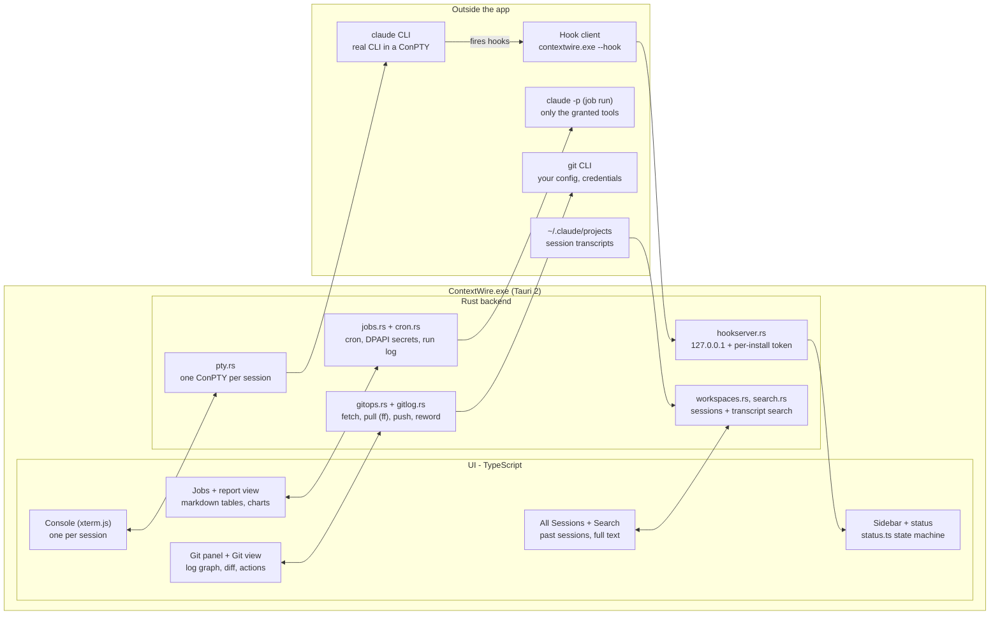

# Architecture

ContextWire is a Tauri 2 app: a Rust backend that owns processes, files and the hook
server, and a vanilla TypeScript UI with xterm.js. It never scrapes the terminal - status
arrives through Claude Code hooks.

Double arrows are Tauri commands and events between the UI and the backend. The status
path: `claude` fires a hook, the hook client posts it to the local hook server, and the
UI's status machine updates the row.

## How a session starts

Each console runs `claude --session-id <uuid> --settings session-hooks.json` (or
`--resume <uuid>`) in the chosen folder. The hooks file registers
`contextwire.exe --hook` for `SessionStart`, `UserPromptSubmit`, `PreToolUse`,
`PostToolUse`, `Notification`, `Stop` and `SessionEnd`, so nothing in your global Claude
settings changes.

The hook client forwards the event to the app over localhost and always exits `0` within
about half a second, so it can never block or break Claude - even when ContextWire is not
running.

## Modules

| Path | What |
| --- | --- |
| `src-tauri/src/pty.rs` | ConPTY session manager (spawn, write, resize, kill, exit) |
| `src-tauri/src/hookserver.rs`, `hook.rs` | Localhost hook endpoint and the `--hook` client |
| `src-tauri/src/claudecfg.rs` | Per-session hooks file; opt-in global hooks with backup |
| `src-tauri/src/workspaces.rs`, `search.rs` | Past sessions and workspace folders from `~/.claude/projects`; transcript search |
| `src-tauri/src/jobs.rs`, `cron.rs`, `secrets.rs` | Scheduled jobs: store, scheduler, runner; cron parser; DPAPI seal/open |
| `src-tauri/src/gitops.rs`, `gitlog.rs` | Git panel actions; Git view log, branches, files, diffs |
| `src-tauri/src/roadmaps.rs` | Finds and summarises `roadmap.yaml` files |
| `src-tauri/src/toast.rs` | Windows toasts that open the session on click |
| `src-tauri/src/applog.rs` | Rotating log file |
| `src-tauri/src/lib.rs` | Tauri commands, tray, single instance, autostart |
| `src/status.ts` | Pure status machine (hook event -> status / unread / notify) |
| `src/sidebar.ts`, `terminal.ts`, `rail.ts`, `main.ts` | Sidebar, xterm per session, tool-window rail, app state |
| `src/panels/` | Activity, Git, Roadmaps, Search panels |
| `src/gitview/` | The PyCharm-style Git view |
| `src/jobs/` | Jobs panel + editor, report view, markdown/chart renderer |
